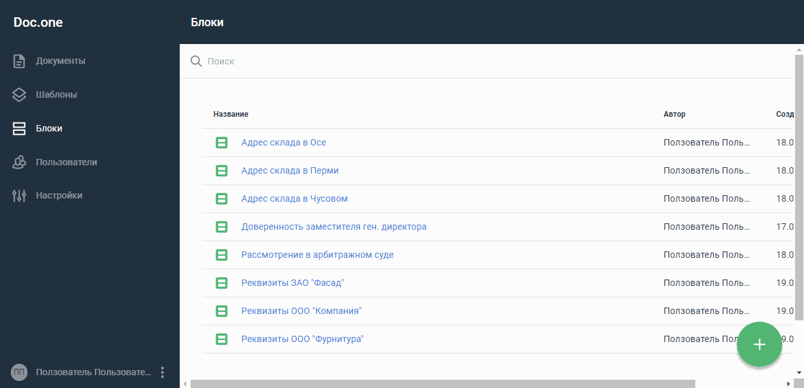

:toc:
:toclevels: 6
:fileModTime:
:experimental:
:imagesdir: \images\

== Копировать документ

. В разделе *Документы* выберите документ, который требуется копировать,
и наведите на него курсор.
. Нажмите появившуюся кнопку *⋮* в конце строки.
. Отобразится меню. Выберите пункт *Копировать*.

В результате в списке отобразится копия выбранного шаблона. В название копии
документа будет добавлено слово «Copy», автором будет указан пользователь, который
 выполнил копирование, а датой – дата копирования.
