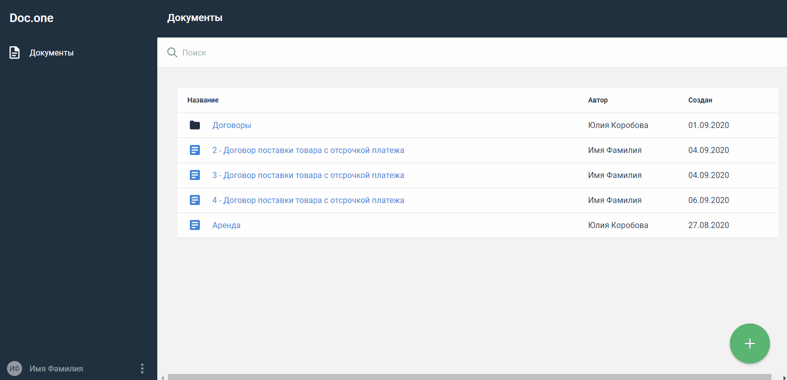

= Создать пакет документов
:imagesdir: \images\

. Откройте раздел *Документы*.
. Нажмите кнопку image:buttons\create.jpg[Создать] в
правом нижнем углу и выберите пункт *Документ*.
. В открывшемся окне в поле *Поиск* начните вводить название пакета шаблонов, на
основе которого нужно создать документы.
. В списке останутся только те шаблоны, которые содержат введенные
символы. Выберите пакет шаблонов в списке.
. В результате откроется страница работы с пакетом. На боковой панели справа представлен
 список документов. Документ, который сейчас открыт в рабочей области, выделен синим.
 Для перехода к другому документу нажмите его наименование в списке.
. Внесите недостающую информацию для каждого документа.

Изменения сохраняются автоматически.

