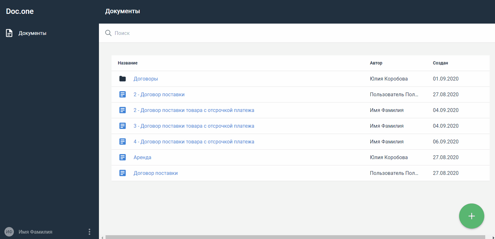

:toc:
:toclevels: 6
:fileModTime:
:experimental:
:imagesdir: \images\

== Удалить документ

. В разделе *Документы* выберите документ, который требуется удалить, и наведите на него курсор.
. Нажмите появившуюся кнопку *⋮* справа от названия документа.
. Выберите пункт *Удалить*.
. Подтвердите действие или отмените удаление.

