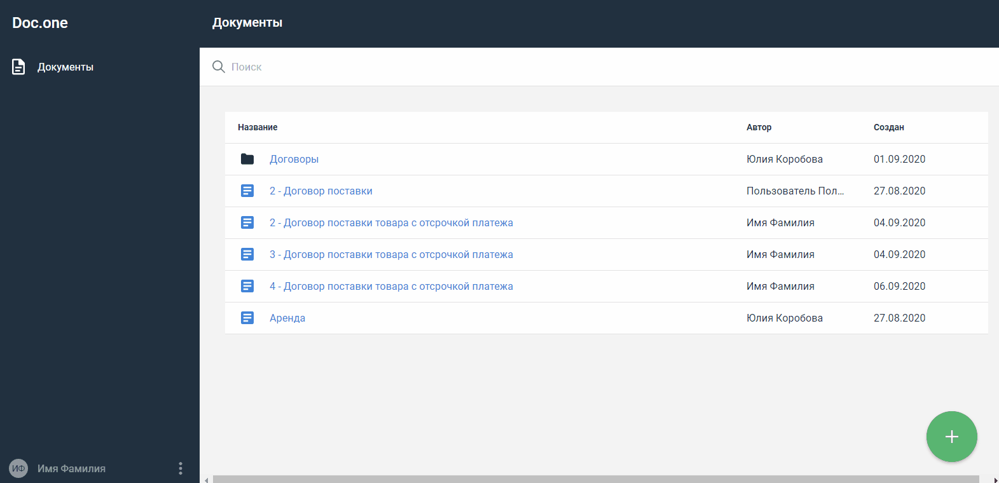

:toc:
:toclevels: 6
:fileModTime:
:experimental:
:imagesdir: \images\

== Как узнать автора и дату создания документа

. Откройте раздел *Документы*.
. Выберите и откройте документ.
. Перейдите на вкладку *НАСТРОЙКИ*, чтобы просмотреть название, автора и дату создания документа.

