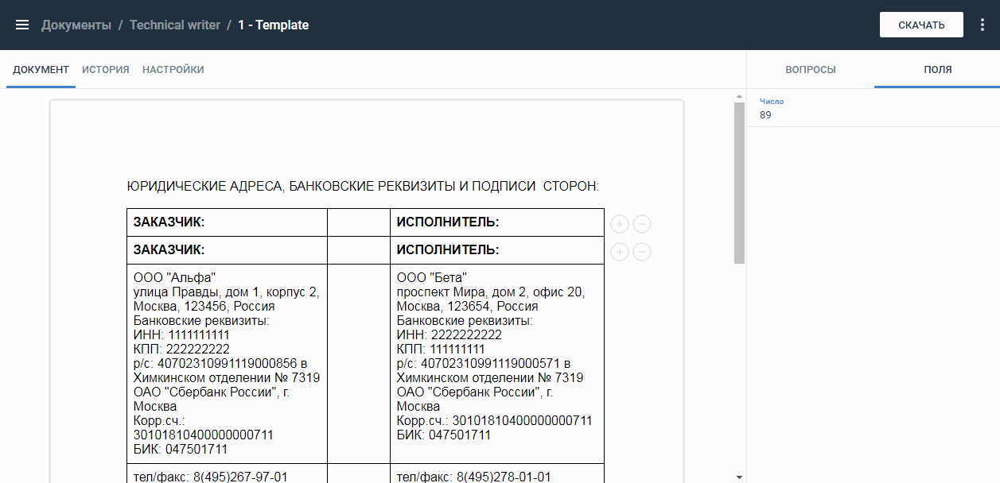

:toc:
:toclevels: 6
:fileModTime:
:experimental:
:imagesdir: \images\

== Восстановить предыдущую версию документа

Вы можете просмотреть историю изменений документа и восстановить одну из
предыдущих версий. Версия документа создается при добавлении строки динамического
 списка, заполнении поля, ответе на вопрос.

=== Просмотреть изменения

Для просмотра изменений перейдите на вкладку *История* страницы шаблона.
Если вы работаете с пакетом документов, откройте нужный документ в списке и
перейдите на вкладку *История*.

На боковой панели вкладки откроется список версий от поздних к ранним. В списке
фиксируются как изменения через интерфейс, так и через API. Для просмотра версии
 выберите ее в списке.

=== Восстановить версию документа

Для восстановления версии документа:

. Перейдите на вкладку *История* страницы документа.
. Выберите версию в списке боковой панели.
. Нажмите кнопку *Восстановить* в правом верхнем углу (кнопка не отображается
для последней версии документа).

Будет создана новая последняя версия документа на основе выбранной в списке.
Восстанавливаются полные данные документа (вопросы и их ответы, поля и их
значения, в том числе строки динамического списка). Если восстановлена версия
документа в составе пакета, совпадающие поля/вопросы обновляются и в остальных
документах пакета.

WARNING: При копировании документа история изменений не копируется.
