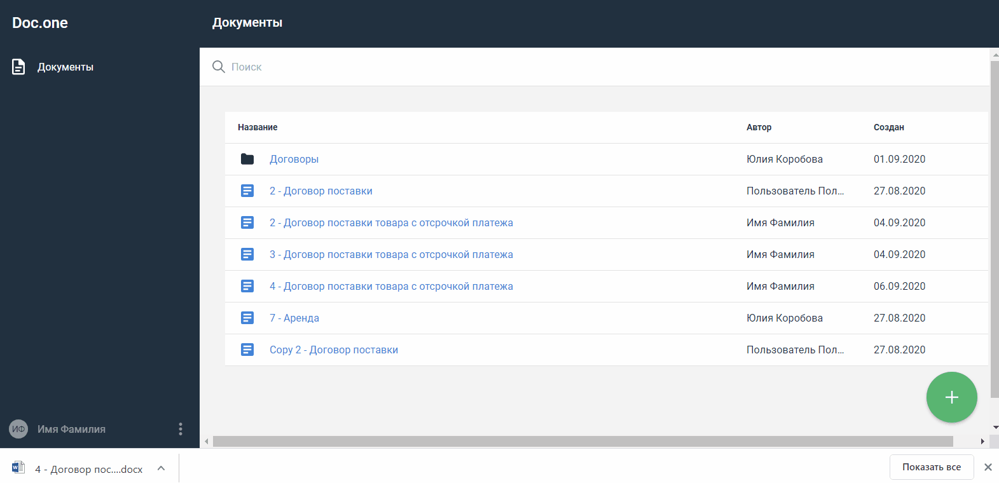

:toc:
:toclevels: 6
:fileModTime:
:experimental:
:imagesdir: \images\

== Изменить название документа

Вы можете изменить название документа на главной странице раздела или непосредственно при работе с документом.

=== В списке документов

. Выберите документ, который нужно переименовать.
. Нажмите кнопку *⋮*  справа и выберите пункт *Переименовать*.
. Название выбранного документа будет выделено цветом.
Установите курсор в строку с названием и укажите новое.
. Нажмите вне области выделения для сохранения изменений.

=== На странице работы с документом

. Перейдите на вкладку *НАСТРОЙКИ*.
. Установите курсор в поле *Название*.
. Измените название.
. Нажмите вне области поля для сохранения изменений.

Вы можете автоматически настроить названия для всех создаваемых на основе шаблона документов
 в разделе Генерация названий документов по шаблону.
